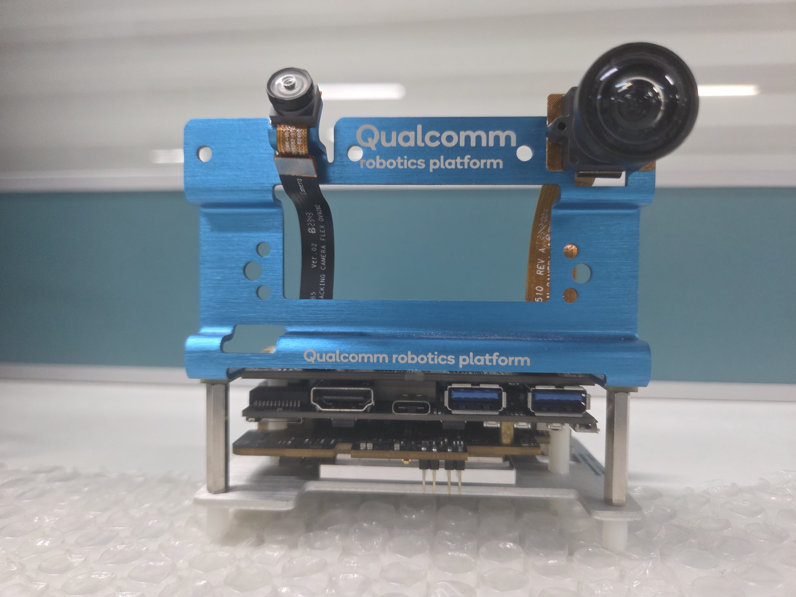
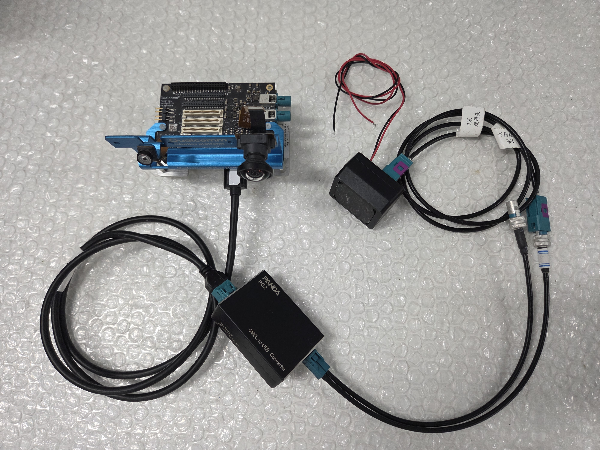

# PANDA Camera Config Guide for Qualcomm Linux

This program is used to load camera configuration files for the PANDA device on Qualcomm Linux.


All configurations and procedures below are validated on the Qualcomm Robotics RB3 Gen 2 Development Kit (hereinafter "Qualcomm RB3")




## 1. Update the Qualcomm Linux software

Please refer to the Qualcomm official documentation:

[Update the Qualcomm Linux software](https://docs.qualcomm.com/doc/80-70029-251/topic/upgrade-rb3gen2-software.html?product=1601111740013077&facet=Linux%201.x%20user%20guide#upgrade-rb3gen2-software)

The SDK version used in this case is:

x86-qcom-6.6.119-QLI.1.8-Ver.1.1_qim-product-sdk-image-2.3.1.zip

## 2. Update the USB and Ethernet controller firmware

If the USB Type-A port is not functioning properly, please follow the steps below to update the firmware:

[How do you update the USB and Ethernet controller firmware](https://docs.qualcomm.com/doc/80-70029-251/topic/faqs.html?product=1601111740013077&facet=Linux%201.x%20user%20guide#usb-firmware)


## 3. Configure and Bring up PANDA Camera

Please refer to the Qualcomm official documentation for USB camera configuration:

[Configure USB camera](https://docs.qualcomm.com/doc/80-70029-8/topic/usb.html#configure-usb-camera)


### 3.1 Cross-Compile Yavta on the Host Machine

a. Set Up the Cross-Compilation Environment
```
sudo apt install gcc-aarch64-linux-gnu
```

b. Clone the Yavta Repository and Cross-Compile
```
git clone https://github.com/fastr/yavta.git
cd yavta
make ARCH=arm64 CROSS_COMPILE=aarch64-linux-gnu-
```
Upon successful compilation, the yavta executable will be generated.

c. Deploy Yavta to the Qualcomm RB3 Device
```
# Transfer via SCP to the target device
scp -r yavta root@192.168.160.186:/root
```

### 3.2 Cross-Compile PandaCtrl on the Host Machine

a. Extract Sysroot on Qualcomm RB3

The sysroot provides headers and libraries required for cross-compiling PandaCtrl.
```
# Execute on Qualcomm RB3
tar -zcvf sysroot.tar.gz /sysroot/ostree/deploy/poky/deploy/<commit-hash>/*
```

Note: The <commit-hash> path varies depending on the device's OS version. Run ls /sysroot/ostree/deploy/poky/deploy/ first to confirm the actual directory name.

Transfer Sysroot to Host Machine
```
# Execute on host: pull sysroot.tar.gz from Qualcomm RB3
scp -r root@192.168.160.186:/root/sysroot.tar.gz .
```

Extract Sysroot
```
mkdir sysroot
tar -zxvf sysroot.tar.gz -C sysroot
```

b. Set Up the Cross-Compilation Environment
```
sudo apt install gcc-aarch64-linux-gnu
```

c. Clone PandaCtrl Source Repository
```
git clone git@github.com:SENSING-Technology/PandaCtrl.git -b qualcomm_linux
cd PandaCtrl
```

Configure SYSROOT Path in Makefile

Edit PandaCtrl/Makefile and update the SYSROOT variable to the actual absolute path:
```
SYSROOT ?= /home/ubuntu2204/qualcomm/sysroot
```

d. Execute Cross-Compilation
```
make clean && make
```
Upon successful compilation, the PandaCtrl executable will be generated.

e. Deploy to Qualcomm RB3
```
# Push PandaCtrl to target device via SCP
scp -r PandaCtrl root@192.168.160.186:/root

# Push camera config file to target device via SCP
scp -r profilePath root@192.168.160.186:/root

```

### 3.3 Bring Up the PANDA Camera



a. Connect Panda Box + Camera to Qualcomm RB3 and Verify Device Node

Connect the Panda Box and Camera module to the USB Type-A port of the Qualcomm RB3 via USB cable;

Execute lsusb to confirm device enumeration:
```
lsusb
# Expected output:
# Bus 002 Device 008: ID 04b4:00c3 Cypress Semiconductor Corp. SENSING_USB3_CAMERA
```

Identify the corresponding V4L2 video device node (e.g., /dev/video2)

For example
```
root@qcs6490-rb3gen2-vision-kit:~# lsusb
Bus 001 Device 001: ID 1d6b:0002 Linux Foundation 2.0 root hub
Bus 001 Device 002: ID 05e3:0610 Genesys Logic, Inc. Hub
Bus 002 Device 001: ID 1d6b:0003 Linux Foundation 3.0 root hub
Bus 002 Device 002: ID 05e3:0625 Genesys Logic, Inc. USB3.2 Hub
Bus 002 Device 006: ID 0b95:1790 ASIX Electronics Corp. AX88179 Gigabit Ethernet
Bus 002 Device 008: ID 04b4:00c3 Cypress Semiconductor Corp. SENSING_USB3_CAMERA
root@qcs6490-rb3gen2-vision-kit:~#
root@qcs6490-rb3gen2-vision-kit:~#
root@qcs6490-rb3gen2-vision-kit:~# ls /dev/video2
/dev/video2
root@qcs6490-rb3gen2-vision-kit:~#
```

b. Load Camera Configuration
```
./PandaCtrl [Absolute path of the configuration file]
```

Using DMSBBFAN Camera as Example
```
root@qcs6490-rb3gen2-vision-kit:~# ./PandaCtrl profilePath/DMSBBFAN_1600x1300@30fps_yuv.ini
Kernel driver active, detaching...
Device opened successfully
  i2c=0x90 regaddr = 0x0010  val = 0x91
  i2c=0x90 regaddr = 0x0313  val = 0x00
  i2c=0x90 regaddr = 0x0001  val = 0x01
  i2c=0x90 regaddr = 0x0320  val = 0x28
  i2c=0x80 regaddr = 0x0010  val = 0x91
  i2c=0x80 regaddr = 0x02be  val = 0x00
  i2c=0x80 regaddr = 0x0057  val = 0x12
  i2c=0x80 regaddr = 0x005b  val = 0x11
  i2c=0x80 regaddr = 0x0318  val = 0x5e
  i2c=0x80 regaddr = 0x02d3  val = 0x00
  i2c=0x80 regaddr = 0x02d6  val = 0x00
  i2c=0x80 regaddr = 0x02d3  val = 0x00
  i2c=0x80 regaddr = 0x02d3  val = 0x84
  i2c=0x80 regaddr = 0x02d5  val = 0x07
  i2c=0x80 regaddr = 0x02d6  val = 0x84
  i2c=0x80 regaddr = 0x02d8  val = 0x07
  i2c=0x80 regaddr = 0x02be  val = 0x10
  i2c=0x90 regaddr = 0x0320  val = 0x2a
  i2c=0x90 regaddr = 0x0313  val = 0x02
  i2c=0x90 regaddr = 0x0003  val = 0x40
  i2c=0x90 regaddr = 0x02c5  val = 0x83
  i2c=0x90 regaddr = 0x02c6  val = 0xa7
```

c. Query Camera Supported Resolutions and Frame Rates

```
yavta /dev/video2 --enum-formats
```

For example
```
root@qcs6490-rb3gen2-vision-kit:~# yavta /dev/video2 --enum-formats
Device /dev/video2 opened: SENSING_USB3_CAMERA (usb-0001:04:00.0-1.2).
- Available formats:
        Format 0: YUYV (56595559)
        Type: Video capture (1)
        Name: YUYV 4:2:2
        Frame size: 1600x1300 (1/30)

Video format: YUYV (56595559) 1600x1300
```

d. Bring Up the camera
```
export XDG_RUNTIME_DIR=/dev/socket/weston && export WAYLAND_DISPLAY=wayland-1

gst-launch-1.0 -e v4l2src device="/dev/video2" ! video/x-raw,format=YUY2,width=1600,height=1300,framerate=30/1 ! waylandsink
```